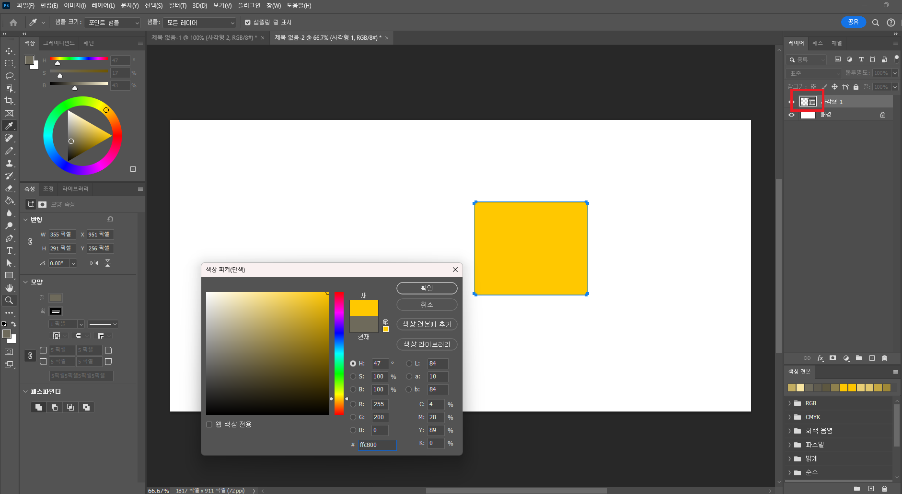

.png){: .light .w-75 .shadow .rounded-10 w='1000'}

{: .light .w-75 .shadow .rounded-10 w='1000'}

If the preview is not supported when changing the color in the Properties tab, you can double-click the layer preview to bring up the color picker, allowing you to change the color in real-time.